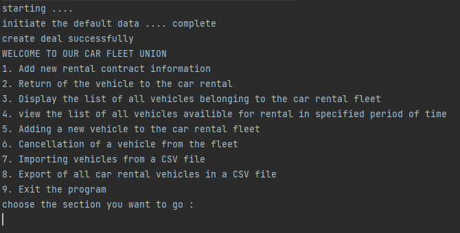

#Excercise 5

Here is the menu of the program looks like : 

Note that to use section 7, you need to place the csv file to import
under the resource folder of the project, which is: 
<folder_root_folder>/src/main/resource

the result of the section 8 will also be in the resource folder:
<folder_root_folder>/src/main/resource

To run the project
1. Open the project in your Idea or cd to the project path
2. run the following command: 

- clean : mvn clean install
- mvn exec:java -D"exec.mainClass"="Main"